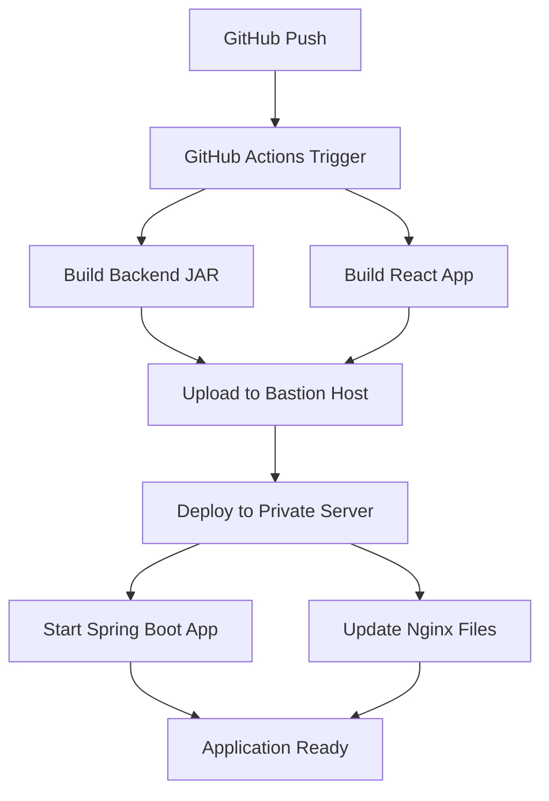

# AWS EC2 フルスタックアプリケーション デプロイメント完全ガイド

## 📋 プロジェクト概要
Spring Boot (Java) + React フルスタックアプリケーションを AWS EC2 上にデプロイし、GitHub Actions による CI/CD パイプラインを構築

**🎯 最終成果：**
- ✅ フロントエンド: http://3.106.239.127 (React + Nginx)
- ✅ バックエンドAPI: http://3.106.239.127/api/items (Spring Boot)
- ✅ 自動デプロイ: GitHub Actions CI/CD パイプライン

---

## 🏗️ AWS インフラ構築

### 1. VPC とネットワーク設定
```
MyVPC (10.0.0.0/16)
├── PublicSubnet (10.0.1.0/24)
│   ├── Bastion Host (3.106.239.127)
│   └── Internet Gateway
├── PrivateSubnet (10.0.2.0/24)
│   └── Private EC2 (10.0.2.123)
└── NAT Gateway (プライベートサブネット用インターネットアクセス)
```

### 2. セキュリティグループ
- **BastionSG**: SSH (22), HTTP (80), HTTPS (443) を許可
- **PrivateSG**: バスチョンからのSSH (22), アプリケーション (8080) を許可

### 3. EC2 インスタンス
- **Bastion Host**: t2.micro (パブリックサブネット)
- **Private Server**: t2.micro (プライベートサブネット)

---

## 💻 サーバー環境構築

### Bastion Host にインストールしたもの
```bash
# OpenSSH クライアント (Windows PowerShell PATH設定済み)
# SSH キー配置: MyKeyPair.pem (権限600)
```

### Private Server にインストールしたもの
```bash
# Java環境
sudo dnf update -y
sudo dnf install java-17-amazon-corretto-devel -y

# Node.js (フロントエンドビルド用)
curl -fsSL https://rpm.nodesource.com/setup_lts.x | sudo bash -
sudo dnf install nodejs -y

# Maven (バックエンドビルド用)
sudo dnf install maven -y

# MariaDB (データベース)
sudo dnf install mariadb105-server -y
sudo systemctl start mariadb
sudo systemctl enable mariadb

# Nginx (Webサーバー・リバースプロキシ)
sudo dnf install nginx -y
sudo systemctl start nginx
sudo systemctl enable nginx
```

### データベース設定
```sql
-- MariaDB 設定
CREATE DATABASE demo_db;
CREATE USER 'demo_user'@'localhost' IDENTIFIED BY 'demo_password';
GRANT ALL PRIVILEGES ON demo_db.* TO 'demo_user'@'localhost';

-- テストデータ (20件のアイテム)
INSERT INTO item (name, price, in_stock) VALUES 
('Sample Item 1', 1000, 1),
('Sample Item 2', 1500, 0),
-- ... 20件のデータ
```

---

## 🔧 アプリケーション修正

### バックエンド修正 (Spring Boot)
**1. ItemService.java (Line 49)**
```java
// 修正前
Item item = new Item(itemDto.getName(), itemDto.getPrice(), 0.0);
// 修正後  
Item item = new Item(itemDto.getName(), itemDto.getPrice(), 0);
```

**2. ItemRepository.java**
```java
// メソッド名を修正
List<Item> findByInStockInt(int inStock);
long countByInStockInt(int inStock);
```

**3. application.properties**
```properties
# プロダクション設定
server.address=0.0.0.0
server.port=8080
spring.datasource.url=jdbc:mariadb://localhost:3306/demo_db
spring.datasource.username=demo_user
spring.datasource.password=demo_password
```

### フロントエンド設定 (React)
**APIエンドポイント設定**
```javascript
// src/App.js - APIベースURL
const API_BASE_URL = 'http://3.106.239.127:8080';
```

---

## 🚀 GitHub Actions CI/CD パイプライン

### ワークフロー構成 (.github/workflows/deploy.yml)

**トリガー:**
```yaml
on:
  push:
    branches: [ main ]
  pull_request:
    branches: [ main ]
```

**実行ステップ:**

1. **環境構築**
   - ✅ Java 17 (Amazon Corretto)
   - ✅ Node.js 20
   - ✅ Maven依存関係キャッシュ

2. **ビルド**
   - ✅ バックエンド: `mvn clean package -DskipTests`
   - ✅ フロントエンド: `npm ci && npm run build`

3. **デプロイ**
   - ✅ JARファイルアップロード (`appleboy/scp-action`)
   - ✅ React ビルドアップロード (`appleboy/scp-action`)
   - ✅ アプリケーションデプロイ (`appleboy/ssh-action`)

**使用技術:**
- `appleboy/ssh-action@v1.0.0` - SSH実行
- `appleboy/scp-action@v0.1.4` - ファイル転送
- タイムアウト設定で高速化 (3-4分で完了)

---

## 🔐 セキュリティ設定

### GitHub Secrets
```
EC2_HOST=3.106.239.127
EC2_SSH_PRIVATE_KEY=[MyKeyPair.pemの内容]
```

### SSH 設定
- ✅ キーベース認証
- ✅ StrictHostKeyChecking=no (CI/CD用)
- ✅ 多段SSH (Bastion → Private Server)

---

## 📊 デプロイフロー



---

## 🎯 成果と効果

### Before (手動デプロイ)
- ❌ 手動SSH接続・ファイル転送
- ❌ 手動ビルド・起動
- ❌ エラーが起きやすい
- ❌ 時間がかかる (30分以上)

### After (自動デプロイ)
- ✅ GitHub Push だけで自動デプロイ
- ✅ 一貫性のあるビルド環境
- ✅ エラーハンドリング
- ✅ 高速デプロイ (3-4分)

---

## 🛠️ トラブルシューティング履歴

### 解決した主要問題
1. **SSH接続問題** → OpenSSH PATH設定
2. **Java型変換エラー** → ItemService.java修正
3. **データベース接続** → MariaDB設定・認証
4. **ネットワーク接続** → server.address=0.0.0.0設定
5. **GitHub Actions SSH** → 専用Action使用・タイムアウト設定

---

## 📝 次のステップ

### 可能な改善点
1. **監視・ログ** - CloudWatch ログ統合
2. **負荷分散** - Application Load Balancer
3. **データベース** - RDS移行
4. **セキュリティ** - IAMロール使用
5. **環境分離** - dev/staging/prod環境

### 運用手順
1. コードを編集
2. `git push origin main`
3. GitHub Actions で自動デプロイ
4. http://3.106.239.127 で確認

---

## 👥 チーム共有事項

### 必要な権限・アクセス
- AWS アカウント (EC2, VPC管理)
- GitHub リポジトリアクセス
- SSH キー (MyKeyPair.pem)

### 緊急時対応
- Bastion Host: `ssh -i MyKeyPair.pem ec2-user@3.106.239.127`
- Private Server: バスチョン経由でアクセス
- アプリログ: `/home/ec2-user/app.log`
- Nginx ログ: `/var/log/nginx/`

---

**🎉 プロジェクト完成日: 2025年1月30日**  
**⏱️ 総開発時間: 約6時間 (インフラ構築からCI/CD完成まで)**
